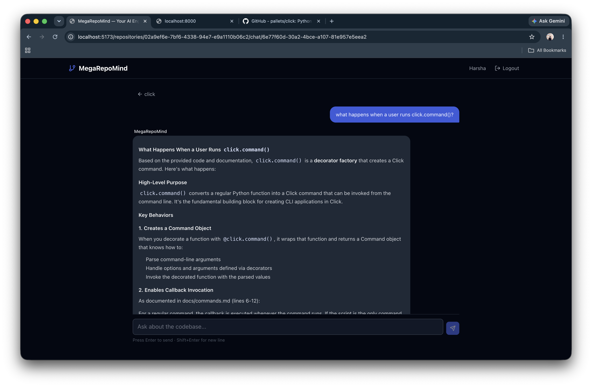

# MegaRepoMind

**Your AI Engineering Teammate** — Paste any GitHub repository and instantly understand its architecture, APIs, and implementation details through an AI-powered chat interface.

## Demo




## What It Does

- Paste a GitHub URL → repository gets cloned, parsed, and indexed
- Ask any question about the codebase
- Get precise answers with **file-level citations** (file path + line numbers)
- All backed by a RAG pipeline: embeddings → vector search → Claude AI

## Tech Stack

| Layer | Technology |
|---|---|
| Frontend | React, TypeScript, Tailwind CSS, React Query |
| Backend | FastAPI, SQLAlchemy (async) |
| Database | PostgreSQL + pgvector |
| Embeddings | sentence-transformers (all-MiniLM-L6-v2, runs locally) |
| LLM | Anthropic Claude API (claude-haiku-4-5) |
| Background Jobs | FastAPI BackgroundTasks |
| Deployment | Docker, Render + Neon + Vercel |

## Architecture

```
GitHub URL
    │
    ▼
Ingestion Service
(clone + walk files)
    │
    ▼
Code Chunker
(language-aware: Python def/class, JS export/function)
    │
    ▼
Embedding Model
(all-MiniLM-L6-v2, local, offline)
    │
    ▼
PostgreSQL + pgvector
(cosine similarity index)
    │
    ▼
Retrieval Layer
(top-K chunk search)
    │
    ▼
Claude API
(answer + file citations)
    │
    ▼
Chat UI (React)
```

## Performance

- Repository indexing: ~30–120 seconds (depends on repo size)
- Retrieval latency: <500ms per query
- Supports up to 300 files per repository
- Language support: Python, JavaScript, TypeScript, Go, Rust, Java, and more

## Engineering Challenges

### Memory Optimization on Free Tier
Initially used Celery + Redis for background indexing, but running Celery worker + uvicorn + the embedding model together exceeded the 512MB RAM limit on Render's free tier. Replaced Celery with FastAPI `BackgroundTasks` and moved all blocking operations (git clone, embedding) into `asyncio.to_thread()` to avoid blocking the event loop without spawning a separate process.

### Database Connection Reliability
Neon PostgreSQL (serverless) drops idle connections after a timeout. SQLAlchemy's connection pool would try to reuse dead connections and throw `InterfaceError: connection is closed`. Fixed with `pool_pre_ping=True` (tests connection before use) and `pool_recycle=300` (recycles connections every 5 minutes).

### Embedding Model Cold Start
The sentence-transformers model hung on first load because `huggingface_hub` tried to phone home to `huggingface.co` to check for model updates — a hostname Render's free tier couldn't resolve. Fixed by pre-downloading the model into the Docker image at build time and loading with `local_files_only=True` at runtime.

### Cross-Origin Cookie Auth
Vercel frontend + Render backend = cross-origin. HTTPOnly cookies require `SameSite=None; Secure` in cross-origin contexts. Defaulting to `SameSite=Lax` caused all authenticated requests to return 401. Added environment-aware cookie config: `samesite="none"` in production, `"lax"` in development.

## Quick Start

### Prerequisites
- Docker + Docker Compose
- Anthropic API key (get one at https://console.anthropic.com)

### 1. Clone and configure

```bash
git clone https://github.com/HKanaparthi/MegaRepoMind
cd MegaRepoMind
cp .env.example .env
```

Edit `.env` and add your `ANTHROPIC_API_KEY`.

### 2. Run

```bash
docker compose up --build
```

- Frontend: http://localhost:5173
- Backend API: http://localhost:8000
- API Docs: http://localhost:8000/docs

### 3. Use it

1. Register an account
2. Paste a GitHub repository URL
3. Wait for indexing (30 seconds – 2 minutes depending on repo size)
4. Start chatting with the codebase

## Project Structure

```
MegaRepoMind/
├── backend/
│   ├── app/
│   │   ├── api/routes/     # FastAPI route handlers
│   │   ├── core/           # Config, security (JWT/bcrypt)
│   │   ├── db/             # SQLAlchemy async engine
│   │   ├── models/         # ORM models (User, Repository, Chunk, Chat)
│   │   ├── schemas/        # Pydantic request/response schemas
│   │   └── services/       # Business logic (ingestion, chunking, RAG, chat)
│   └── requirements.txt
├── frontend/
│   └── src/
│       ├── pages/          # Login, Dashboard, Repository, Chat
│       ├── components/     # Layout, ChatMessage
│       ├── hooks/          # useAuth
│       └── services/       # API client (axios)
├── docker-compose.yml
└── .env.example
```
